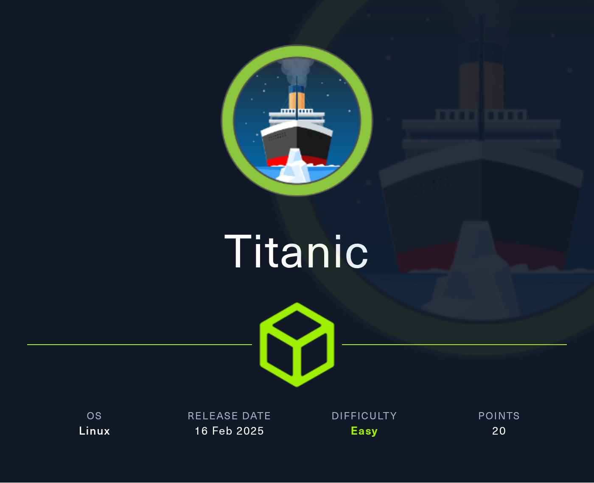

# 📖HTB-writeups
# 📈Labs

<table>
<tr>
<td>Titanic </td>
<td>Acast  402 bytes</td>
<td>Access  349 bytes</td>
<td>ActivityPub  337 bytes</td>
<td>Adobe  220 bytes</td>
<td>Airbnb  356 bytes</td>
</tr>
</table>
