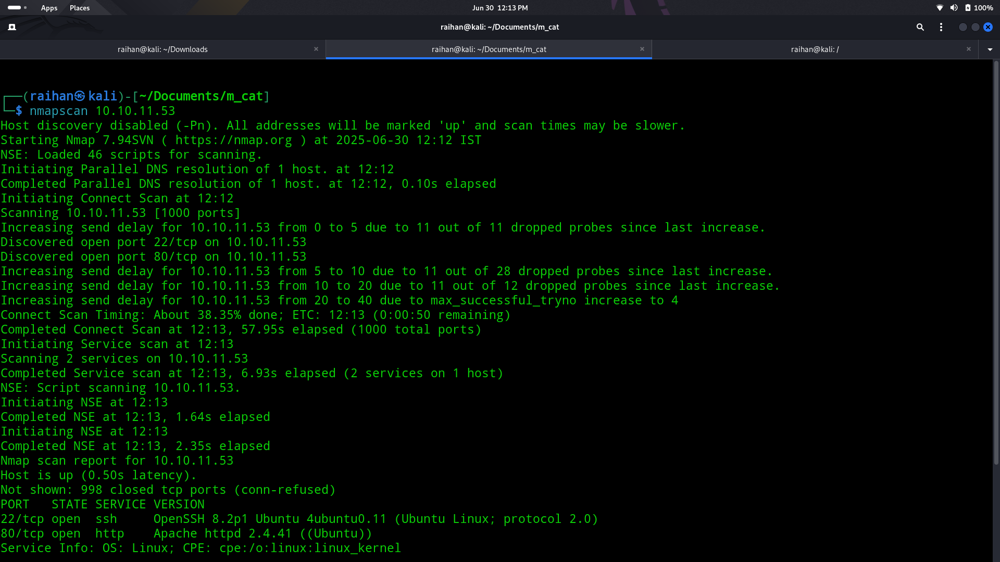

# 🐱‍💻Cat

## 🧠Summary
> A quick TCP scan revealed only ports 80 (HTTP) and 22 (SSH). The web root leaked a full .git directory; using git-dumper I rebuilt the repo locally and spotted an unsanitised username field in join.php. By injecting a one-liner that sent request data to a Python HTTP listener on my box, I intercepted the admin’s session cookie.With that cookie I ran sqlmap against the site and dumped the database, cracking user rosa’s hash with John and SSH’ing in. System recon uncovered Apache logs in /var/log/apache2 that disclosed axel’s clear-text password, granting the user flag.For root, netstat -tlnp showed an internal service on port 3000. I used SSH port-forwarding (ssh -L 3000:127.0.0.1:3000) to reach a private Gitea instance. Creating a repo let me push a crafted a payload to obtain a index.php, browsing the raw file revealed the password of root, ran su root, and captured the root flag.

## ↘️ASCII Visual
```text
[ Nmap ] → 80,22
      |
      v
[ /.git leak ]
      |
      v
git-dumper  →  join.php vuln  →  inject λ(payload)
      |                                 |
      |<–—– HTTP listener logs admin cookie
      v
[ sqlmap --cookie ]  → dump DB → crack rosa
      |
 SSH (rosa)
      |
      v
/var/www/apache2 logs → axel pwd → SSH (axel) → user.txt
      |
      v
netstat → 127.0.0.1:3000
SSH -L 3000:127.0.0.1:3000
      |
      v
[Gitea]  → push repo to gain root password
      |
decode →  su root  →  root.txt
```

## 🔎Nmap scan
- Did a nmap scan to find the open ports
- The result revealed port 80 and port 22 opened
  

## 🌐Web enumeration
- Did web enumeration to find that the /.git file is asseceble
- So used git-dumper to download all the git file
  ```bash
  git-dumper http://cat.htb/.git/ ./cat_git_repo
  ```
- The downloaded file 👉 [cat_git_repo](./cat_git_repo)
- Read throught the file to find that in the username form there is no sanitation so used the below payload to intercept all the send and recieve data
  ```html
  
  ```
- This helped to obtained the cookie of admin

## 📌Loop hole
- From the obtained cookie used it in sqlmap to gain the database
  ```bash
  sqlmap -u "http://cat.htb/accept_cat.php" --data "catId=1&catName=catty" --cookie="PHPSESSID={admin cookie}" -p catName --level=5 --risk=3 --dbms=SQLite -T "users" --threads=8 --dump
  ```
- From the above database got a hash, decoded using john
- SSH into the system as Rosa but found that user flag was with Axel

## ⚓Foothold
- Looked through the system using Rosa and found out about /var/log/apache2 cat the contents inside it to see the password of Axel hardcoded inside it
- Tried prevelage escalation and found out that the machine hosted a webpage in port 3000
- Port forwarded it to see the webpage content and found out it is a gitea instance
- Using a XSS script from a documentation of gitea which comes under CVE ID : CVE-2024-6886
- Pushed and send a mail using to the other developer to pull the inserted code (social engineering)
- After a few attempt of sending the request it got accepted (Note: This is just a bot based social engineering)
- Then got the root password which got dumped in a file called as index.php
- Used sudo su and gained root access and gain the root flag ✍️
