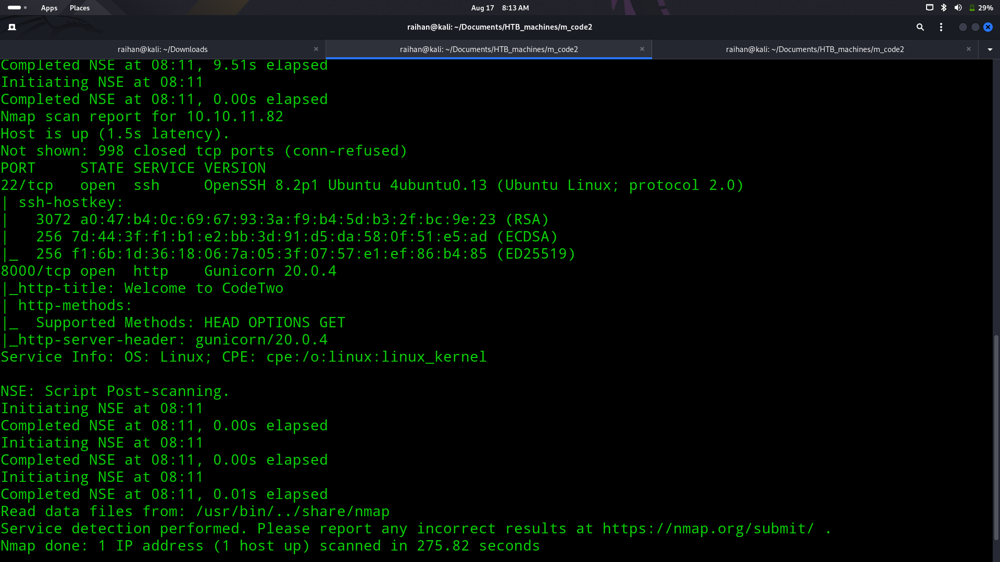
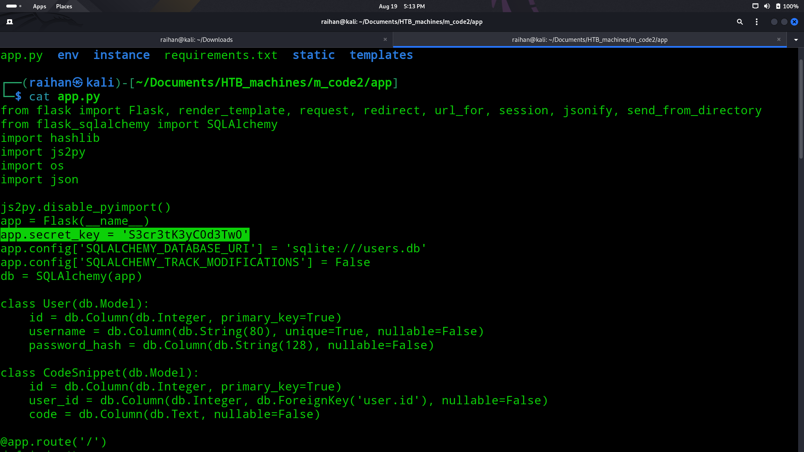
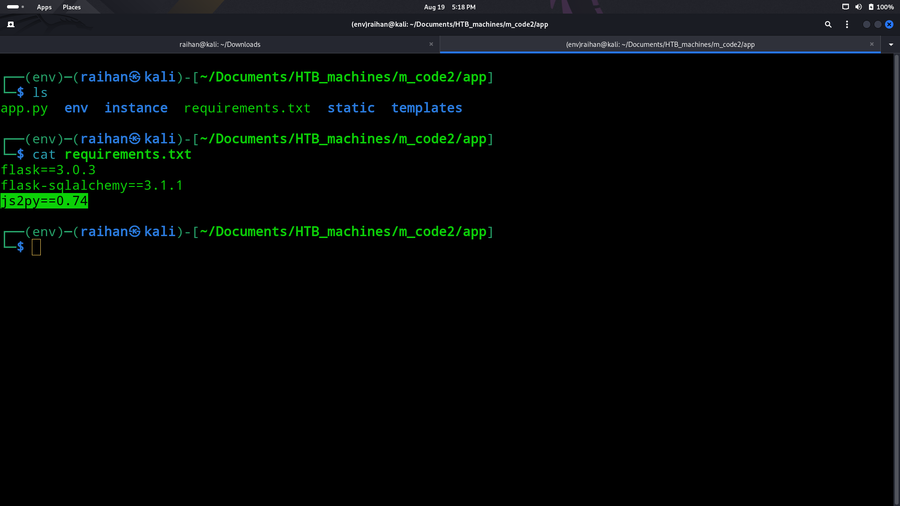
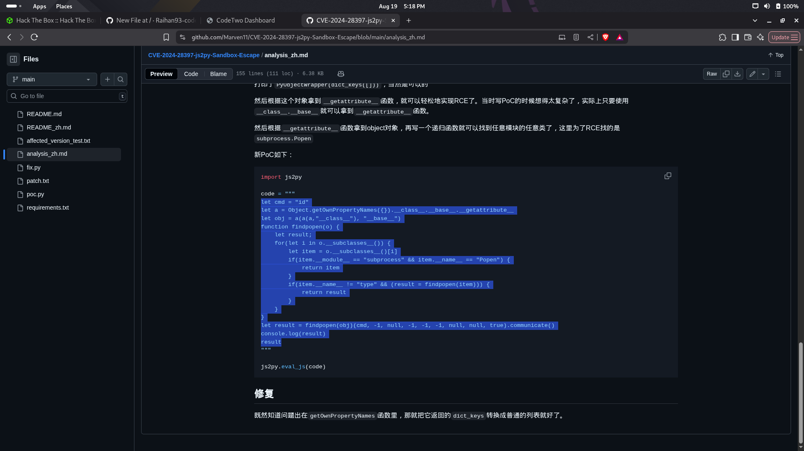
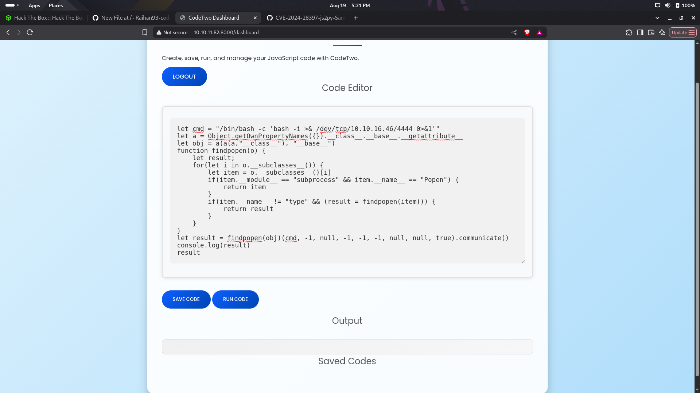
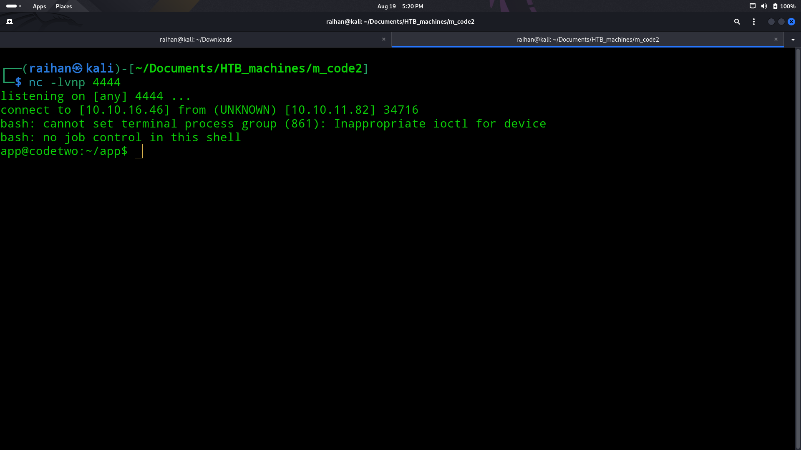
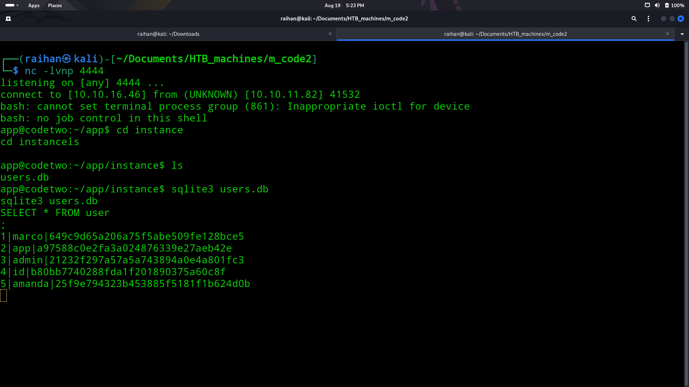
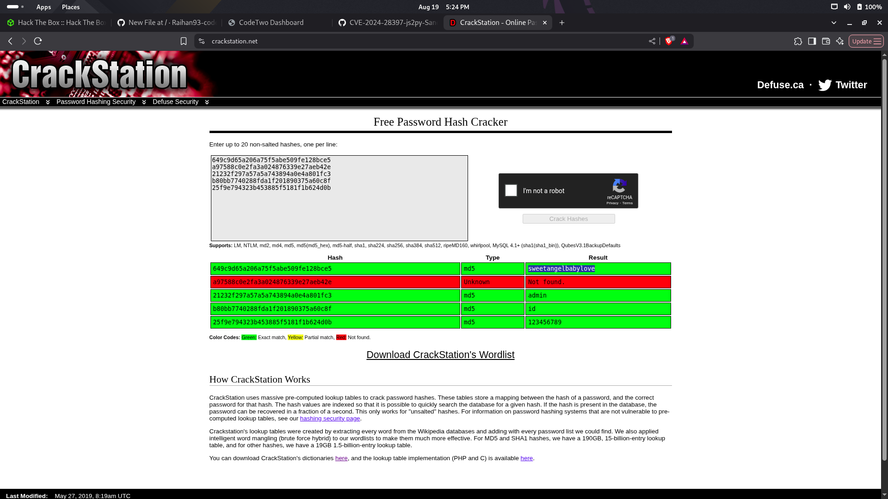
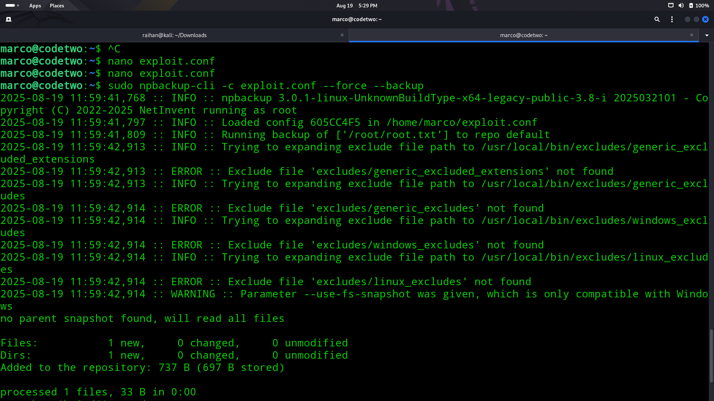

# 📟CodeTwo

## 🧠Summary
> I began with an Nmap scan and discovered ports 8000 and 22 open. On port 8000, I found a JavaScript code editor and used a hidden download endpoint to retrieve the backend code. Inside, I found a hardcoded Flask app.secret_key, which I leveraged to forge an admin session cookie. Exploring further, I noticed the js2py v0.74 module and used the known CVE-2024-28397 to execute a reverse shell. From the session, I extracted user.db, dumped hashes with SQLite, cracked Marco’s password on Crackstation, and SSH’d into the box to grab the user flag. For privilege escalation, I discovered npbackup-cli via sudo -l, crafted a malicious exploit.conf, and forced a backup of /root/root.txt. Finally, I dumped the snapshot to retrieve the root flag and fully compromised the machine.

## 💡CVEs used:
- $${\color{#90EE90}CVE-2024-28397 (js2py) }$$

## ↘️ASCII Visual
```text
[Nmap] → Ports 8000 (Web), 22 (SSH)  
   |  
   v  
[Web App (8000)] → JS Code Editor → /download endpoint  
   |  
   v  
[Flask Source Code] → Hardcoded app.secret_key → Forged session cookie → Admin access  
   |  
   v  
[Backend Analysis] → js2py v0.74 → CVE-2024-28397 → Sandbox escape → Reverse shell  
   |  
   v  
[Shell] → Found user.db → Extracted hashes → Cracked creds (Marco)  
   |  
   v  
[SSH as Marco] → User flag  
   |  
   v  
[Privilege Escalation] → sudo -l → npbackup-cli → exploit.conf injection  
   |  
   v  
[Forced backup /root/root.txt] → Dump snapshot → Root flag  
   |  
   v  
[ROOT PWNED ✅]  

```

## 🔎Nmap scan
- Ran an nmap scan to discover services:
  
- Found only:
    - 22/tcp - SSH
    - 8000/tcp - Webpage hosted

## 📌Loop hole
- I found an endpoint called /download to get the backend code of the website
  
- I found the key which is to generate cookie so i used flask-unsign to generate a cookie to gain admin login
  ```bash
  flask-unsign --sign --cookie "{'user_id':1,'username':'admin'}" --secret 'S3cr3tK3yC0d3Tw0'
  ```
- I entered the webpage as admin then further I checked the tech stack to find that this works in js2py module
  
- I checked the web to find a CVE under this and found a payload in github for this to escape the js2py sandbox
  
- I injetced this into the code editor interface by modifing to gain a reverse shell and it was successful
  
  
- I found the database in the instance dir i used sqlite3 and sql query to gat the password hash
  
- I used crackstation and got the password
  

## 🧪Post Exploitation
- I entered the system using SSH as Marco and gained the user flag
- The I did sudo -l to find an application called npbackup-cli
- I read about the app and found a npbackup.conf I checked it and changed one line in that will work as my exploit
  
  
- I used the below command after writing the exploit.conf file
  ```bash
  sudo npbackup-cli -c exploit.conf --force --backup
  sudo npbackup-cli -c exploit.conf --snapshots
  sudo npbackup-cli -c exploit.conf --dump /roo/root.txt --snapshot-id [snapshot id]
  ```
  
  
- I then finally gained root flag 🏴‍☠️
