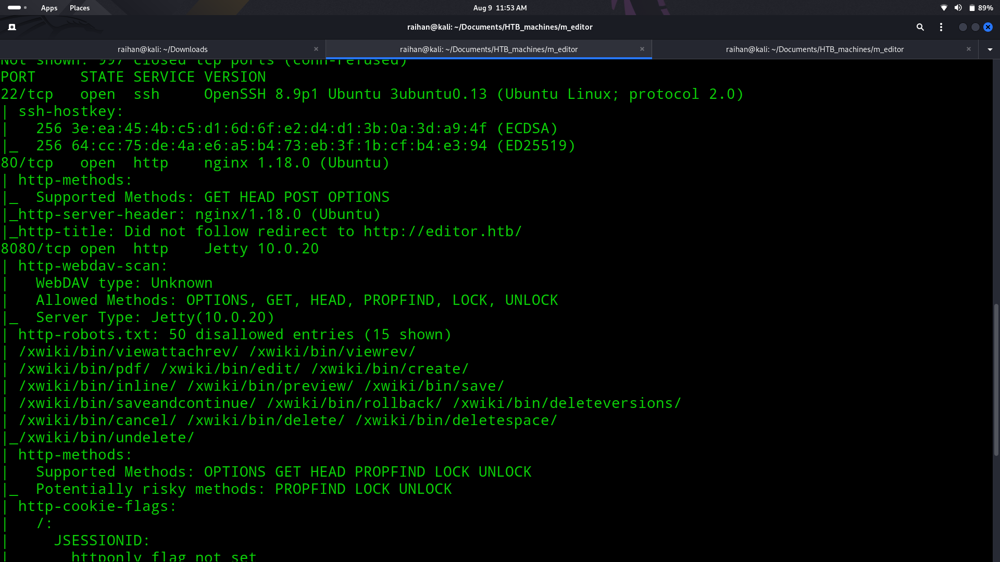
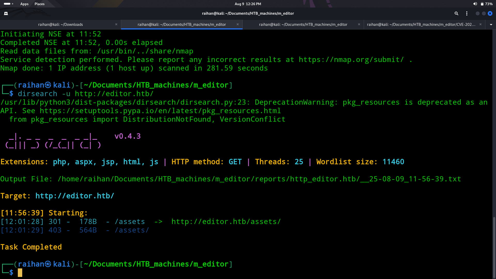
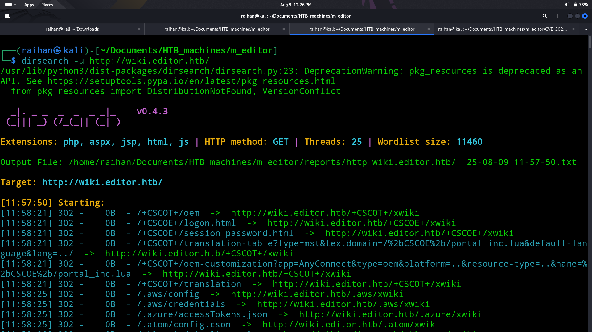
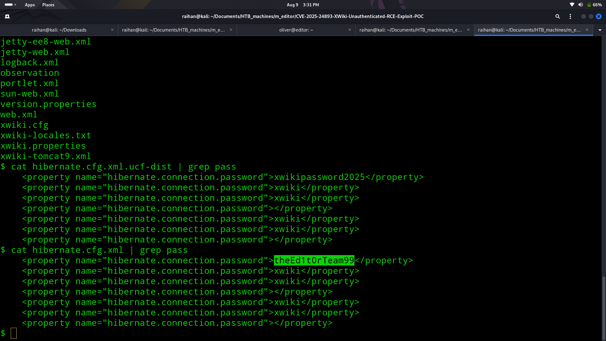
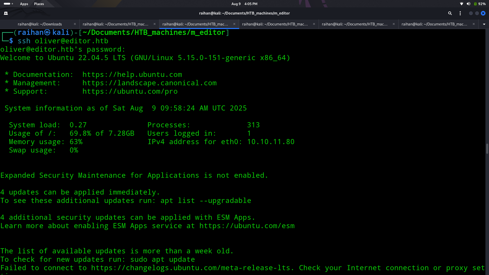
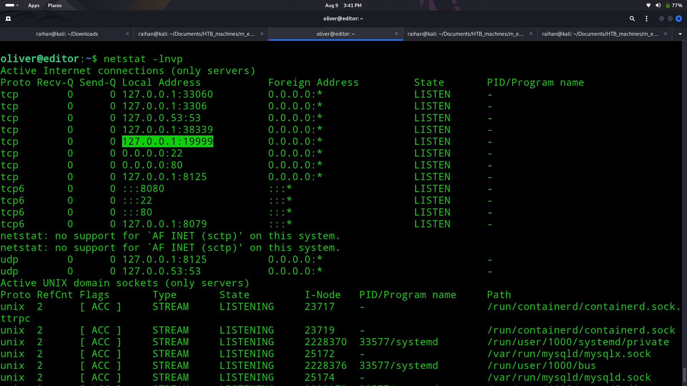
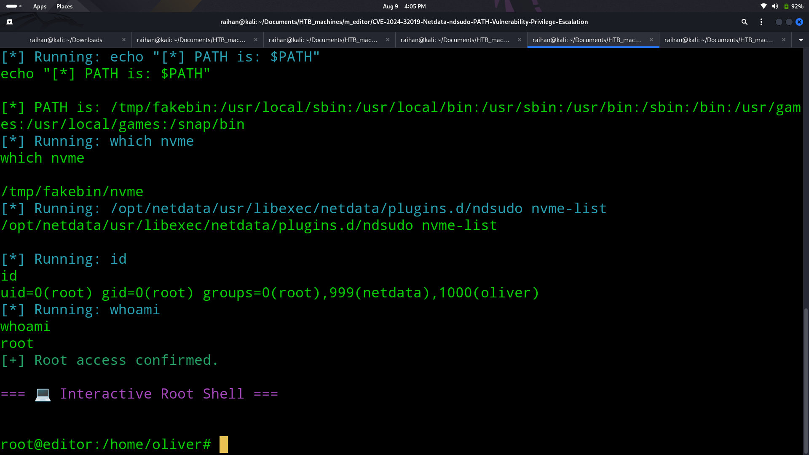

# 📓Editor

## 🧠Summary
> An Nmap scan revealed ports 80 (HTTP) and 22 (SSH) and 8080 (HTTPS) open. Manual browsing uncovered wiki.editor.htb, whose Wiki version was vulnerable to CVE-2025-24893. Using a public GitHub PoC, I gained a reverse shell as the service user. Enumeration found hibernate.cfg.xml with plaintext credentials, allowing SSH access as the main user to retrieve the user flag. For privilege escalation, netstat showed a local Netdata service on port 19999. After port forwarding, I exploited CVE-2024-32019 via another public PoC to gain root access and retrieve the root flag.

## 💡CVEs used:
- $${\color{#90EE90}CVE-2025-24893 (Xwiki) }$$
- $${\color{#90EE90}CVE-2024-32019 (Netdata)}$$

## ↘️ASCII Visual
```text
[Nmap] → Ports 80, 22, 8080
   |
   v
[HTTP site] → Manual browsing → wiki.editor.htb
   |
Check Wiki version → CVE-2025-24893 → GitHub PoC
   |
Exploit → Reverse shell (service user)
   |
   v
[File enum] → hibernate.cfg.xml → SSH creds
   |
SSH login (user) → user.txt
   |
   v
[No sudo privesc]
   |
netstat → local port 19999 → Netdata
   |
Port forward → CVE-2024-32019 PoC
   |
Exploit → Root shell → root.txt
```

## 🔎Nmap scan
- Ran an nmap scan to discover services:
  
- Found only:
    - 22/tcp - SSH
    - 80/tcp - HTTP

## 📌Loop hole
- I used dirsearch to find something useful but no useful endpoint
  
- Then I checked through the website to find some useful link which leaded me to wiki.editor.htb
- I then went to that website and used dirsearch to see any vulnerable endpoint is preasent so i gained used dirsearch again nothing useful
  
- So I checked the service and version of the webpage and then I searched the web to find a CVE under it and also a public exploit i used git colne to download and run the exploit
- I then gained shell as a service level user
- I then searched through the directories to find a file called as hibernate.cfg.xml which had the password for the user oliver and I ssh into the system using it and gained user flag
  
  
  
## 🧪Post Exploitation
- I did sudo -l nothing useful then checked netstat to find the machine hosting a webpage in port 19999
  
- I port forwarded to get the webpage and found it using a service called as netdata
- I checked the internet about netdata and found a CVE under it
- I got a PoC in github for this CVE I downloaded the CVE and run the exploit in my machine
  
- I gained the reverse shell as root and captured the root flag 🏴‍☠️
