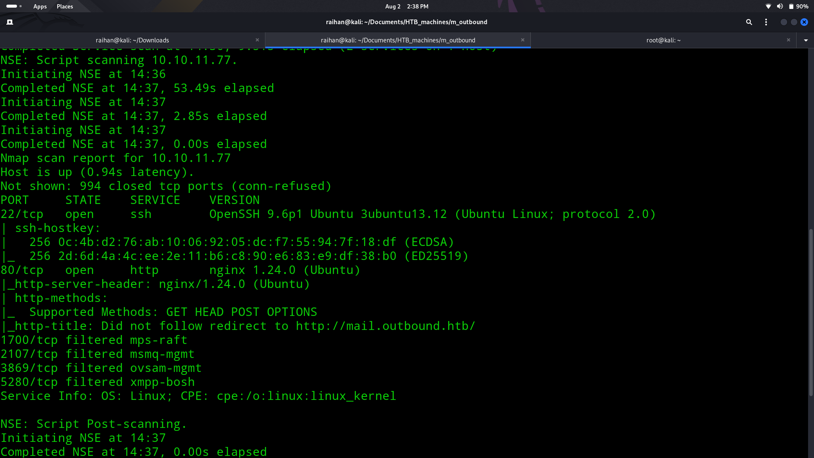
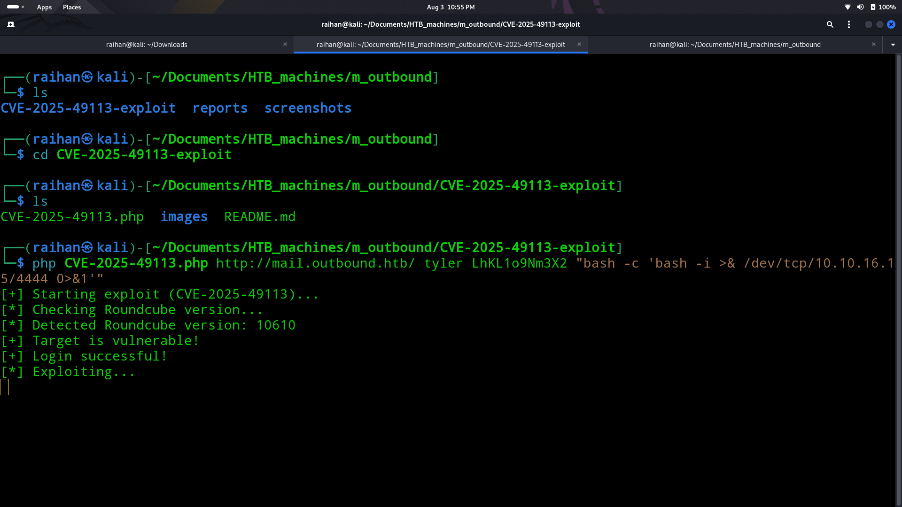
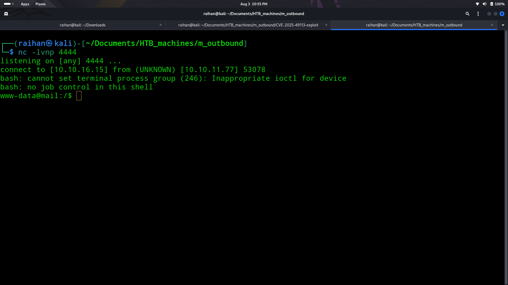
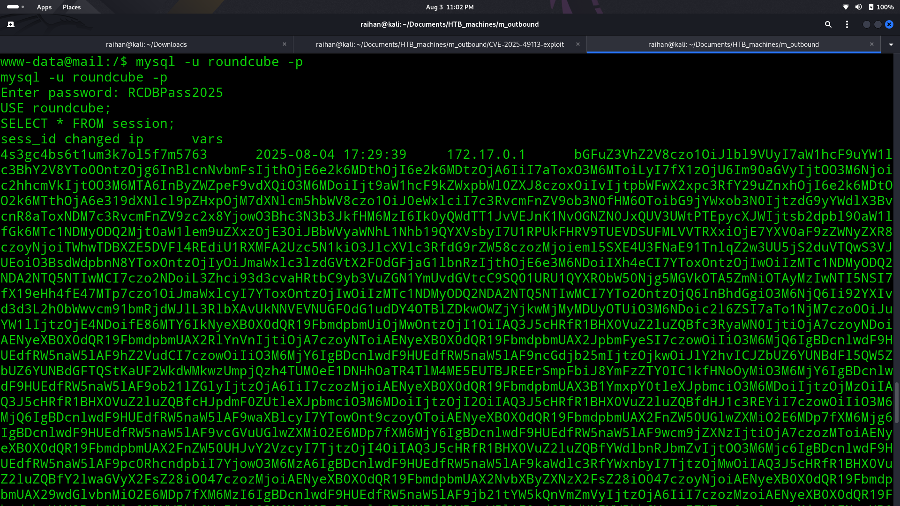
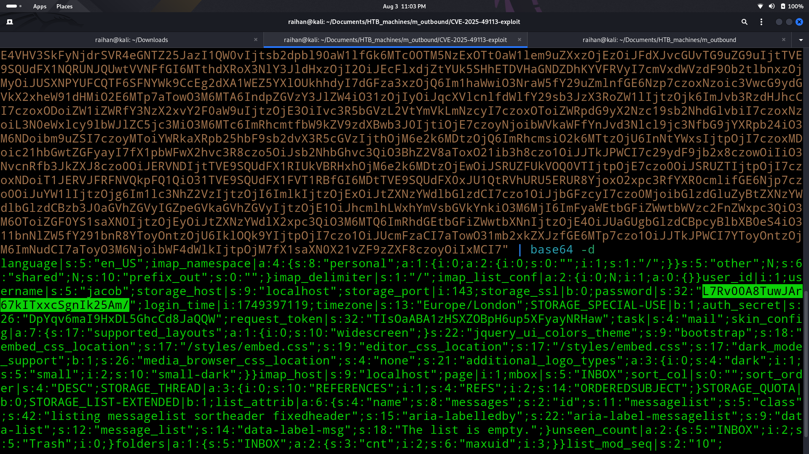
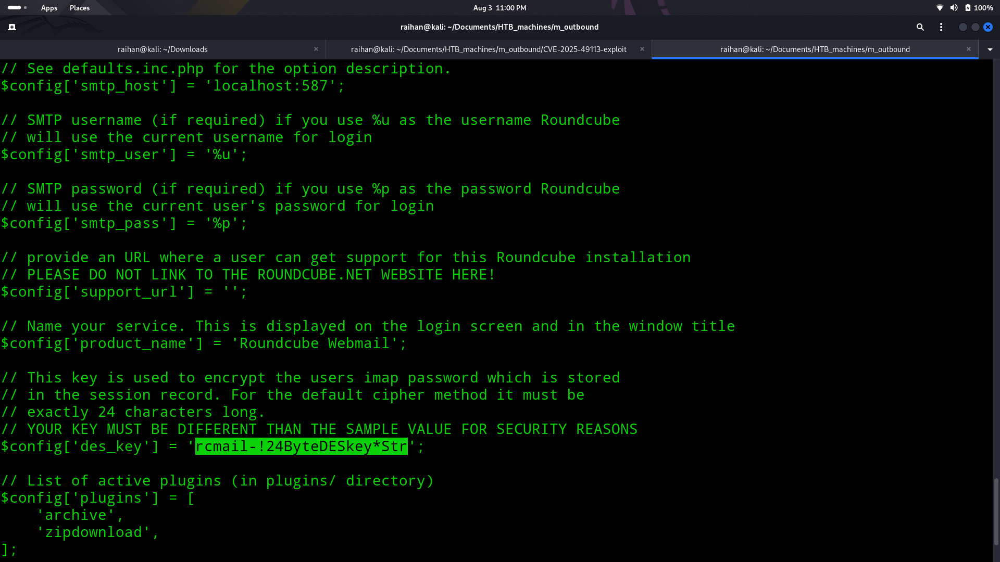
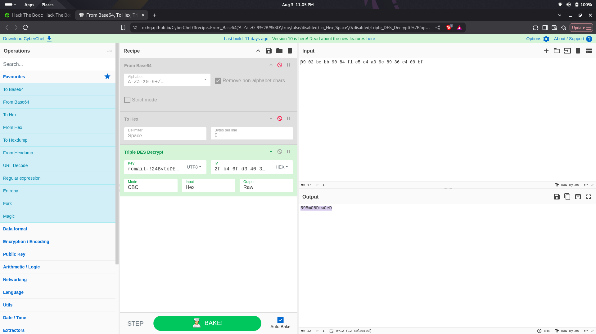
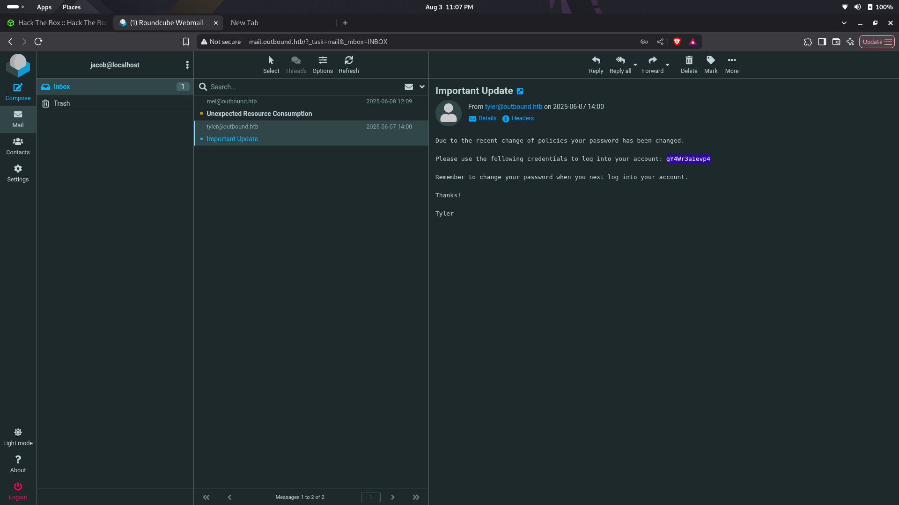
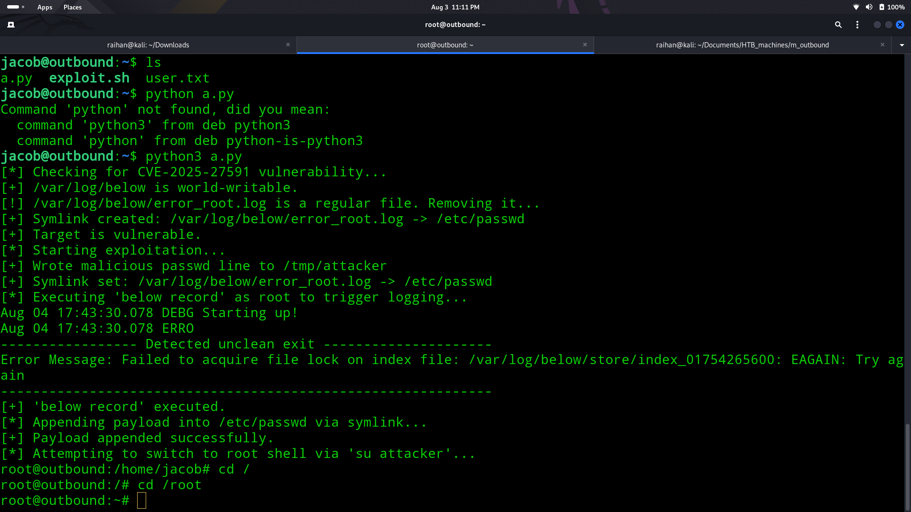

# 📨Outbound

## 🧠Summary
> Initial nmap revealed open ports 80 (HTTP) and 22 (SSH). The web interface exposed a Roundcube mail, client running version 1.6.10. Research confirmed this version is vulnerable to CVE-2025-49113, a Remote Code Execution flaw. Using a public exploit, a reverse shell was obtained as www-data. Manual enumeration revealed config.inc.php containing a MySQL connection string. Credentials extracted from the database included a base64-encoded, encrypted password, decrypted using CyberChef. With the decrypted password, access was gained to Jacob’s webmail account, revealing SSH credentials. Upon SSH’ing into the box as Jacob, privilege escalation was achieved using a local binary called below, exploitable via CVE-2025-27591. The public exploit was uploaded and executed, granting root access.

## 💡CVEs used:
- $${\color{#90EE90}CVE-2025-49113 (Roundcube \space RCE) }$$
- $${\color{#90EE90}CVE-2025-27591 (Below \space binary \space privesc)}$$

## ↘️ASCII Visual
```text
[Nmap] → ports 80, 22
    |
    v
[Port 80 - Roundcube Webmail 1.6.10]
    |
Check version → CVE-2025-49113 → GitHub PoC
    |
Exploit (RCE) → Reverse Shell (www-data)
    |
    v
[Manual enum] → config.inc.php → MySQL creds
    |
base64 decode → Encrypted pwd → CyberChef
    |
Login to Roundcube → Jacob's Mail → SSH creds
    |
    v
[SSH as Jacob] → user.txt
    |
sudo -l → binary: below
    |
Search CVE-2025-27591 → Exploit via GitHub PoC
    |
Upload PoC → Run exploit
    |
[Root shell] → root.txt
```

## 🔎Nmap scan
- Ran an nmap scan to discover services:
  
- Found only:
    - 22/tcp - SSH
    - 80/tcp - HTTP

## 📌Loop hole
- Did web enumeration and found no use
- So checked the version of the app to find a known CVE, CVE ID: CVE-2025-49113
- I found a github repo that has an exploit for this CVE
  
- After that i opened a listener in my computer and gained the reverse shell as www-data
  
- After manual enumeration found a file called config.inc.php that showed me a link to a mysql program
  
- I used the mysql program to get the database and found out that the database was base64 encrypted
  
- I decoded to find again an encrypted password of jacob
  
- I used cyberchef to decode the password but there was one problem I didn't have the decryption key so i checked the config file ones more to find the key
  
  
- Then I logged into the email webpage as Jacob to get the password to SSH into the system
  

## 🧪Post Exploitation
- I did sudo -l to find a binary called as below
- I checked in the web to find a CVE for this CVE ID: CVE-2025-27591
- I used the nano editor and copy pasted the code and executed to get the root access and root flag 🚩
  
